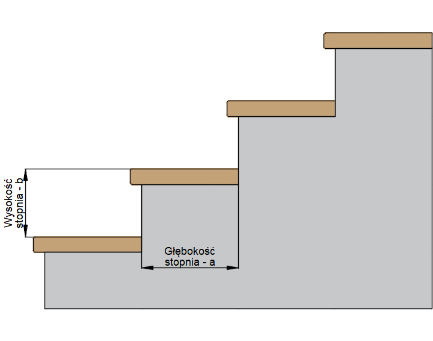
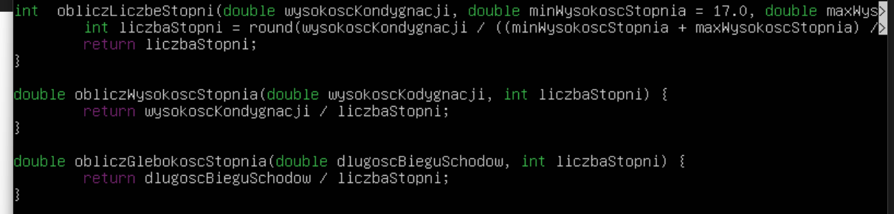

# Kalkulator Schodów

## Opis

Kalkulator schodów to narzędzie, które ułatwia projektowanie schodów, obliczanie ich parametrów oraz dostosowywanie wymiarów do przestrzeni dostępnej w budynku. Aplikacja pozwala na szybkie obliczenia potrzebnych wymiarów schodów takich jak: ilość stopni, wysokość stopni, długość biegu, czy kąt nachylenia schodów, co umożliwia optymalizację projektu pod kątem ergonomii oraz zgodności z przepisami budowlanymi.

## Funkcjonalności:
Obliczanie podstawowych parametrów schodów:

**Liczba stopni:** Na podstawie podanych wymiarów (wysokości kondygnacji i długości biegu schodów, kalkulator oblicza liczbę stopni potrzebnych do pokonania danej wysokości.

**Wysokość stopni:** Program pozwala dostosować wysokość stopni zgodnie z zaleceniami ergonomicznymi, które zwykle wynoszą od 17 do 19 cm.

**Głębokość stopnia:** Program oblicza głębokość stopnia

## Przykładowy wygląd



## Założenie



## Kod

```cpp
#include <iostream>
#include <cmath> // Do użycia funkcji std::floor i std::round

// Funkcja do obliczenia liczby stopni
int obliczLiczbeStopni(double wysokoscKondygnacji, double minWysokoscStopnia = 17.0, double maxWysokoscStopnia = 19.0) {
    // Liczymy wstępnie liczbę stopni dla maksymalnej i minimalnej wysokości stopnia
    int liczbaStopni = std::round(wysokoscKondygnacji / ((minWysokoscStopnia + maxWysokoscStopnia) / 2.0));
    return liczbaStopni;
}

// Funkcja do obliczenia wysokości stopni
double obliczWysokoscStopnia(double wysokoscKondygnacji, int liczbaStopni) {
    return wysokoscKondygnacji / liczbaStopni;
}

// Funkcja do obliczenia głębokości stopni
double obliczGlebokoscStopnia(double dlugoscBieguSchodow, int liczbaStopni) {
    return dlugoscBieguSchodow / liczbaStopni;
}

int main() {
    double wysokoscKondygnacji, dlugoscBieguSchodow;

    std::cout << "Podaj wysokosc kondygnacji (w cm): ";
    std::cin >> wysokoscKondygnacji;

    std::cout << "Podaj dlugosc biegu schodow (w cm): ";
    std::cin >> dlugoscBieguSchodow;

    int liczbaStopni = obliczLiczbeStopni(wysokoscKondygnacji);

    double wysokoscStopnia = obliczWysokoscStopnia(wysokoscKondygnacji, liczbaStopni);

    double glebokoscStopnia = obliczGlebokoscStopnia(dlugoscBieguSchodow, liczbaStopni);

    std::cout << "\nWyniki obliczen:\n";
    std::cout << "Liczba stopni: " << liczbaStopni << "\n";
    std::cout << "Wysokosc stopnia: " << wysokoscStopnia << " cm\n";
    std::cout << "Glebokosc stopnia: " << glebokoscStopnia << " cm\n";

    return 0;
}


```

## Użycie programu

### Wejście
Program wymaga od użytkownika dwóch wartości:
1. **Wysokość kondygnacji** (w cm) - wysokość pionowa schodów, którą muszą pokonać stopnie
2. **Długość biegu schodów** (w cm) - długość pozioma, jaką zajmują schody.

### Wyjście
Po wprowadzeniu danych, program wyświetla:
- Liczbę stopni
- Wysokość Każdego stopnia (w cm)
- Głębokość każdego stopnia (w cm)

### Wyniki

**Wynik** 
calcoolator.pl ( kalkulator schodów )
- Ilość stopni - 14
- Głębokość stopnia (cm) - 28.7
- Wysokość stopnia (cm) - 17.9

## Autorzy

- [Maksym Petrushkevych](https://github.com/meeq11)
