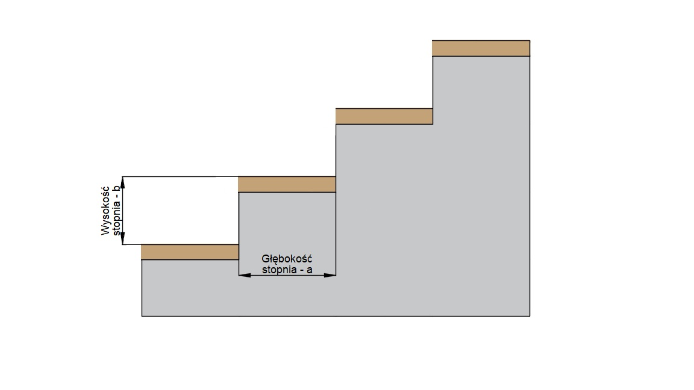

# Kalkulator Schodów

## Opis

Kalkulator schodów to narzędzie, które ułatwia projektowanie schodów, obliczanie ich parametrów oraz dostosowywanie wymiarów do przestrzeni dostępnej w budynku. Aplikacja pozwala na szybkie obliczenia potrzebnych wymiarów schodów takich jak: ilość stopni, wysokość stopni, długość biegu, czy kąt nachylenia schodów, co umożliwia optymalizację projektu pod kątem ergonomii oraz zgodności z przepisami budowlanymi.

## Funkcjonalności:
Obliczanie podstawowych parametrów schodów:

Liczba stopni: Na podstawie podanych wymiarów (wysokości kondygnacji i zalecanej wysokości stopnia), kalkulator oblicza liczbę stopni potrzebnych do pokonania danej wysokości.

Wysokość stopni: Program pozwala dostosować wysokość stopni zgodnie z zaleceniami ergonomicznymi, które zwykle wynoszą od 17 do 19 cm.

Długość biegu schodów: Na podstawie liczby stopni i ich głębokości obliczana jest całkowita długość schodów.

## Przykładowy wygląd

Wszystkie testy przeszły pomyślnie, program działa prawidłowo!!!

## Autorzy

- [Maksym Petrushkevych](https://github.com/meeq11)
