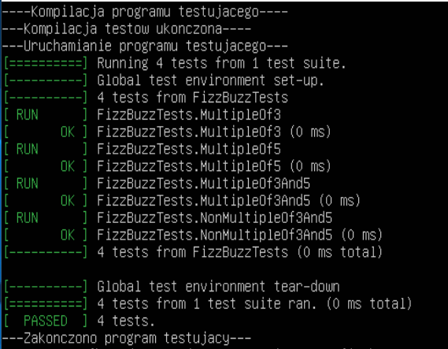

# FizzBuzz Program

## Opis

Program implementuje klasyczną funkcję **FizzBuzz**, która działa zgodnie z poniższymi zasadami:
- Jeśli liczba jest podzielna przez 3, zwraca "Fizz".
- Jeśli liczba jest podzielna przez 5, zwraca "Buzz".
- Jeśli liczba jest podzielna przez 3 i 5, zwraca "FizzBuzz".
- W przeciwnym wypadku zwraca samą liczbę jako ciąg znaków.

Dodatkowo, program zawiera testy jednostkowe napisane w Google Test, które sprawdzają poprawność działania funkcji `fizzBuzz`.

## Testy
| Nazwa testu | Opis | Przykładowe dane wejściowe | Oczekiwany wynik |
|--------------------|--------------------|---------------------|---------------------|
| MultipleOf3 | Testuje przypadki, gdy liczba jest wielokrotnością 3 | 3, 9, 21 | "Fizz" |
| MultipleOf5 | Testuje przypadki, gdy liczba jest wielokrotnością 5 | 5, 10, 20 | "Buzz" |
| MultipleOf3And5 | Testuje przypadki, gdy liczba jest wielokrotnością 3 i 5 | 15, 30, 45 | "FizzBuzz" |
| NonMultipleOf3And5 | Testuje przypadki, gdy liczba nie jest wielokrotnością 3 i 5 | 4, 7, 16 | "4", "7", "16" |
## Kod Testowania
```cpp 
#include <gtest/gtest.h>
#include "functions.cpp"


TEST(FizzBuzzTests, MultipleOf3) {
   EXPECT_EQ(fizzBuzz(3), "Fizz");
   EXPECT_EQ(fizzBuzz(9), "Fizz");
   EXPECT_EQ(fizzBuzz(21), "Fizz");
}

TEST(FizzBuzzTests, MultipleOf5) {
   EXPECT_EQ(fizzBuzz(5), "Buzz");
   EXPECT_EQ(fizzBuzz(10), "Buzz");
   EXPECT_EQ(fizzBuzz(20), "Buzz");
}

TEST(FizzBuzzTests, MultipleOf3And5) {
   EXPECT_EQ(fizzBuzz(15), "FizzBuzz");
   EXPECT_EQ(fizzBuzz(30), "FizzBuzz");
   EXPECT_EQ(fizzBuzz(45), "FizzBuzz");
}

TEST(FizzBuzzTests, NonMultipleOf3And5) {
   EXPECT_EQ(fizzBuzz(4), "4");
   EXPECT_EQ(fizzBuzz(7), "7");
   EXPECT_EQ(fizzBuzz(16), "16");
}

int main(int argc, char **argv) {
    ::testing::InitGoogleTest(&argc, argv);
    return RUN_ALL_TESTS();
}

```


## Zrzuty ekranu i wyniki



Wszystkie testy przeszły pomyślnie
